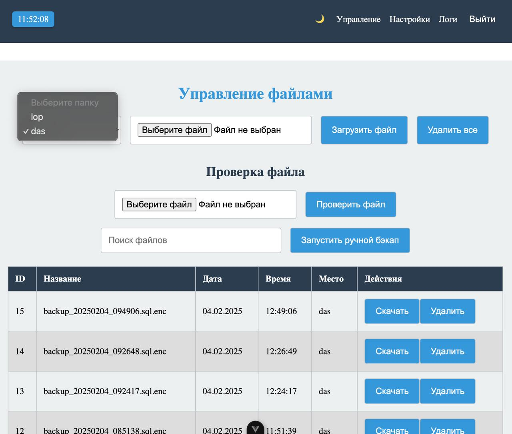
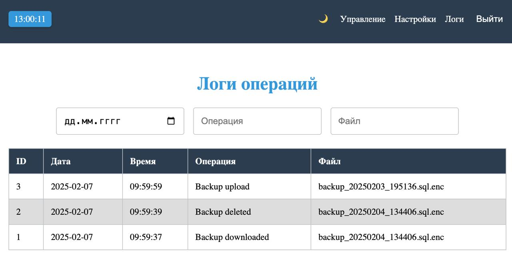
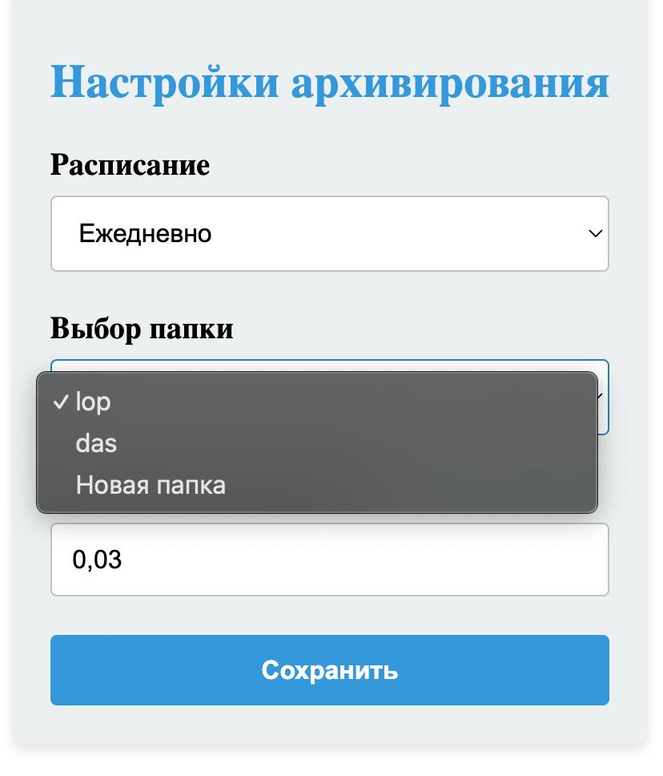
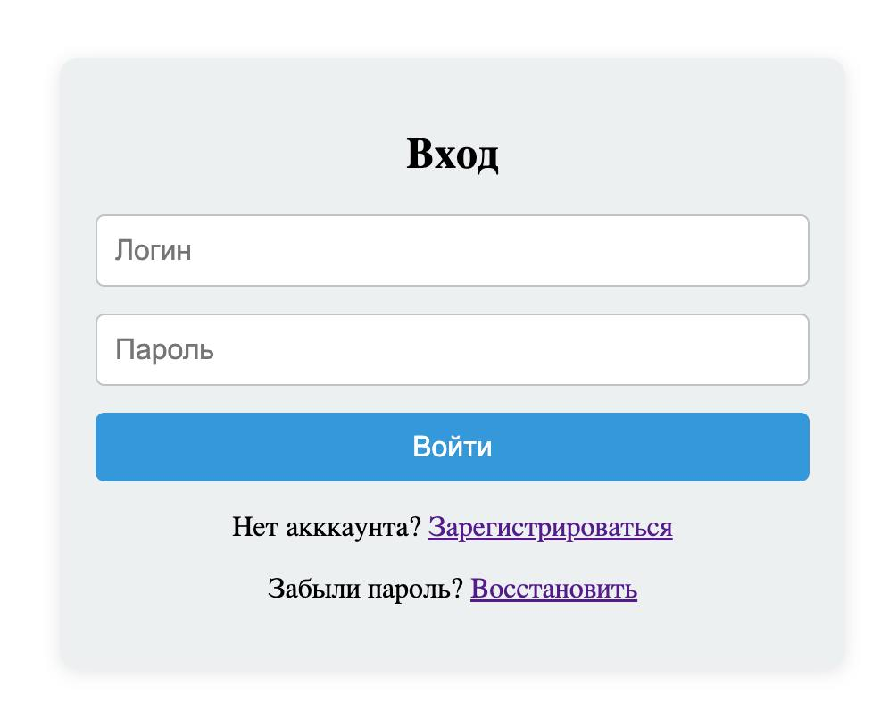
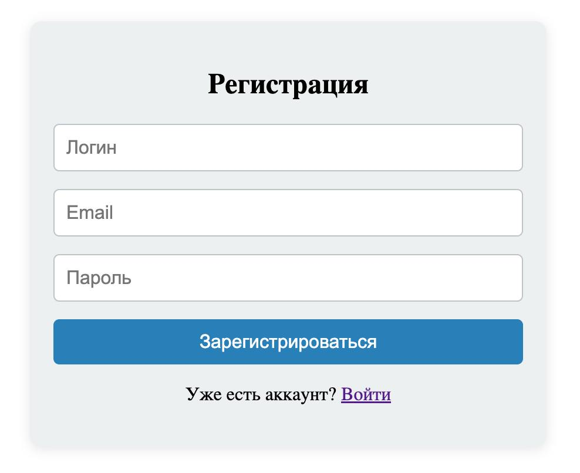
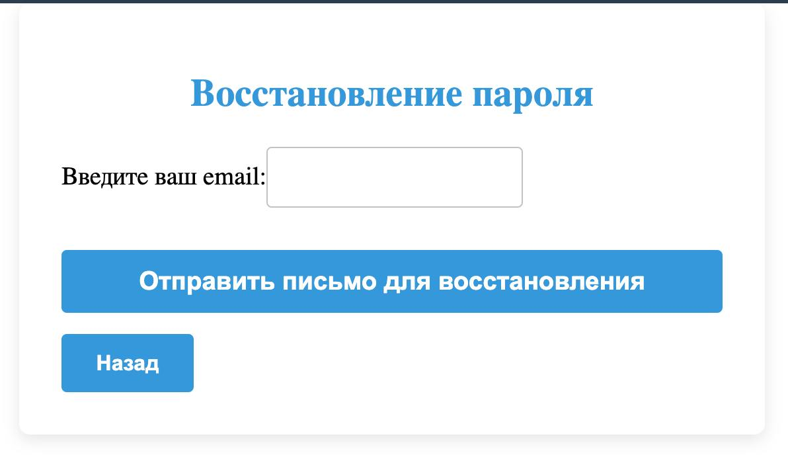

# Система архивации журнала информационной безопасности

## Описание проекта

Система предназначена для управления архивацией записей журнала ИБ 
с возможностью их последующего восстановления. 
Проект решает проблему хранения больших объемов исторических данных,
позволяя освобождать место в основной базе данных без потери доступа к архивной информации.

## Интерфейс системы

### Главная панель


### Управление архивами

### Настройки

### Формы входа, выхода и смены пароля
| Вход                                       | Регистрация                                         | Смена пароля                                               |
|--------------------------------------------|-----------------------------------------------------|------------------------------------------------------------|
|  |  |  |


## Основные функции

### Архивация данных
- **Ручная архивация** (для пользователей с соответствующими правами)
- **Автоматическая архивация по расписанию** (с гибкими настройками периодичности)
- **Архивация по достижению заданного объема данных**
- **Настройка места хранения архивов**

### Разархивация данных
- Загрузка архивов обратно в систему
- Полноценная работа с архивными записями (поиск, фильтрация, просмотр)
- Контроль целостности архивных данных

### Дополнительные возможности
- Логирование всех операций архивации/разархивации
- Надежное разграничение прав доступа
- Защита от модификации архивных данных
- Уведомления о завершении операций

## Технологический стек

### Backend
- **Python 3.9+**
- **Django 4.2** (веб-фреймворк)
- **Django REST Framework** (API)
- **PostgreSQL** (основная БД)
- **Celery** (асинхронные задачи)
- **Django DBBackup** (управление архивами)

### Frontend
- **Vue.js 3** (интерфейс администратора)
- **Axios** (HTTP-клиент)
- **Vuetify** (UI компоненты)

## Установка и запуск

### Требования
- Python 3.9+
- PostgreSQL 12+
- Node.js 16+ (для фронтенда)

### Backend
1. Клонируйте репозиторий:
   ```bash
   git clone https://github.com/your-repo/ib-log-archive-system.git
   cd ib-log-archive-system
   ```

2. Создайте и активируйте виртуальное окружение:
   ```bash
   python -m venv .venv
   source .venv/bin/activate
   ```

3. Установите зависимости:
   ```bash
   pip install -r requirements/prod.txt
   ```

4. Создайте файл `.env` на основе `.env.template` и заполните настройки.

5. Примените миграции:
   ```bash
   python manage.py migrate
   ```

6. Создайте суперпользователя:
   ```bash
   python manage.py createsuperuser
   ```

7. Запустите сервер:
   ```bash
   python manage.py runserver
   ```

### Frontend
1. Перейдите в директорию фронтенда:
   ```bash
   cd front
   ```

2. Установите зависимости:
   ```bash
   npm install
   ```

3. Запустите dev-сервер:
   ```bash
   npm run serve
   ```

## Настройка периодических задач

Для настройки автоматической архивации:
1. Откройте панель администратора Django
2. Перейдите в раздел "Настройки"
3. Создайте новую задачу с выбранным расписанием

## Структура проекта

```
backup_log_system_back/
├── backup/                   # Основная директория для хранения резервных копий
│   ├── exapmle1/                  # Настраиваемые поддиректории
│   ├── exapmle2/
│   ├── exapmle3/
│   ├── secure/               # Хранение ключей шифрования
│   │   ├── keyfile.key
│   │   └── keyfile.key.template
├── backup_log_system_back/   # Основные настройки Django
│   ├── __init__.py
│   ├── asgi.py
│   ├── settings.py           # Основные настройки
│   ├── urls.py               # Корневые URL
│   └── wsgi.py
│
├── core/                     # Основное приложение
│   ├── migrations/           # Миграции базы данных
│   ├── __init__.py
│   ├── admin.py              # Админ-панель
│   ├── apps.py
│   ├── cron.py               # Задачи по расписанию
│   ├── cryption.py           # Шифрование/дешифрование
│   ├── models.py             # Модели данных
│   ├── serializers.py        # Сериализаторы для API
│   ├── tests.py              # Тесты
│   ├── tokens.py             # Токены
│   ├── urls.py               # URL приложения
│   ├── utils.py              # Вспомогательные функции
│   └── views.py              # Представления
│
├── front/                    # Фронтенд на Vue.js
│   ├── dist/                 # Собранный фронтенд
│   ├── public/
│   ├── src/
│   │   ├── api/              # API клиенты
│   │   ├── assets/           # Статические ресурсы
│   │   ├── components/       # Компоненты UI
│   │   ├── composables/      # Композиции Vue
│   │   ├── router/           # Маршрутизация
│   │   ├── store/            # Хранилище состояний
│   │   └── views/            # Страницы
│   ├── package.json
│   └── vite.config.js
│
├── requirements/             # Зависимости Python
│   ├── dev.txt               # Для разработки
│   ├── prod.txt              # Для production
│   └── test.txt              # Для тестирования
│
├── templates/                # Шаблоны Django
│   └── account/              # Шаблоны для аутентификации
│
├── docker-compose.yml        # Конфигурация Docker
├── manage.py                 # Управляющий скрипт Django
└── README.md                 # Документация
```

## Лицензия

Проект распространяется под лицензией MIT.